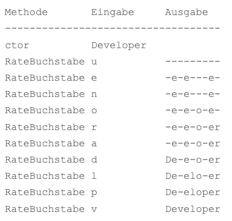

## Galgenmännchen

# Class Kata „Galgenmännchen“
Schreibe eine Klasse Galgenmännchen. Über den Konstruktor erhält die Instanz das gesuchte Wort als String. Ferner verfügt die Klasse über eine Methode RateBuchstabe. Die Methode erhält ein Zeichen als Eingabe und überprüft, an welchen Stellen innerhalb des gesuchten Wortes das Zeichen vorkommt. Die Methode gibt jeweils den bis zu diesem Zeitpunkt erratenen Bestandteil des Worts zurück.

public class Galgenmännchen {

public Galgenmännchen(string gesuchtesWort) { ... }

public string RateBuchstabe(char buchstabe) { ... }

}

Folgende Tabelle zeigt den Verlauf an einem Beispiel.

