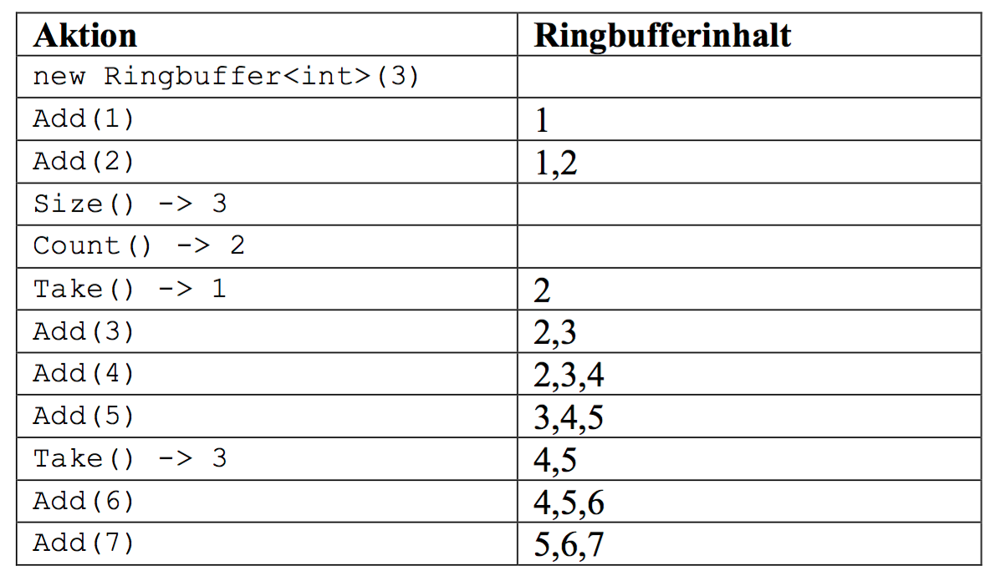

# Ringbuffer

Entwickle eine Klasse, die einen Ringbuffer implementiert.

An einen Ringbuffer können Werte „hinten“ angehängt werden wie an eine Queue (Add()). Und sie können „vorne“ entnommen werden wie aus einer Queue (
Take()). Allerdings hat der Ringbuffer eine begrenzte Kapazität (Size()). Wenn die ausgeschöpft ist, werden Werte „am Anfang“ „überschrieben“, d.h.
dann haben neue Werte Vorrang vor alten.

Das Interface der Klasse soll so aussehen:

``` java
class Ringbuffer<T> {
Ringbuffer(int size) {...}

	void Add(T value) {...} 
	T Take() {...} // nimmt das älteste Element aus dem Buffer
	int Count() {...} // Anzahl ungelesene Elemente (<= Size())
	int Size() {...} // Größe des Ringbuffers
}
```



Quelle: https://kurse.ccd-akademie.de/ringbuffer/