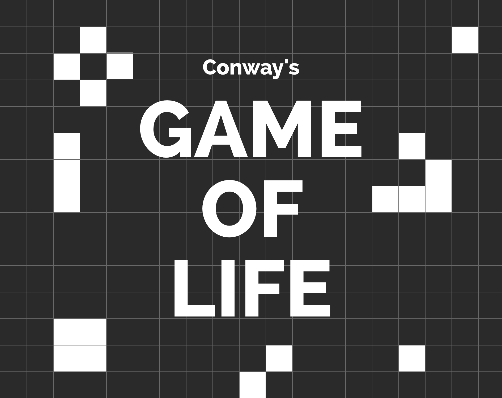

Eine sehr interessante Fingerübung als Kata: Conway's Game of Life.

Mit 4 einfachen Regeln für "Zellwachstum" lässt sich unerwartete Komplexität erzeugen,
indem unterschiedliche Generationen von "Zellwachstum" simuliert werden. Diese "Zellen"
haben nur zwei Zustände: Lebendig oder tot. Die grafische Darstellung des Gitters ist
hierbei nicht Teil der Aufgabe, es geht lediglich um die Berechnung einer Nachfolgegeneration.

Für das Berechnen des Nachfolgezustands einers Gitters aus Zellen gelten die folgenden Regeln:
* Jede lebende Zelle mit zwei oder drei lebenden Nachbarn überlebt bis zur nächsten Generation
* Jede lebende Zelle mit weniger als zwei lebenden Nachbarn stirbt an "Unterbevölkerung"
* Jede lebende Zelle mit mehr als drei lebenden Nachbarn stirbt, an "Überbevölkerung"
* Jede tote Zelle mit genau drei lebenden Nachbarn wird zu einer lebenden Zelle

Aufgabe des Katas ist es, Code zu schreiben, der eine Nachfolgegeneration durch Anwendung dieser 4 Regeln berechnet.

## Hinweise
* "Benachbart" bedeutet horizontal, vertikal, oder diagonal angrenzend
* Zur Vereinfachung der Testfälle beschränken wir das Gitter auf 3x3 Zellen. Das Gitter selbst soll aber so designed sein, dass Höhe und Breite variabel einstellbar sind
* Zellen außerhalb des Gitters zählen als "tot" 
